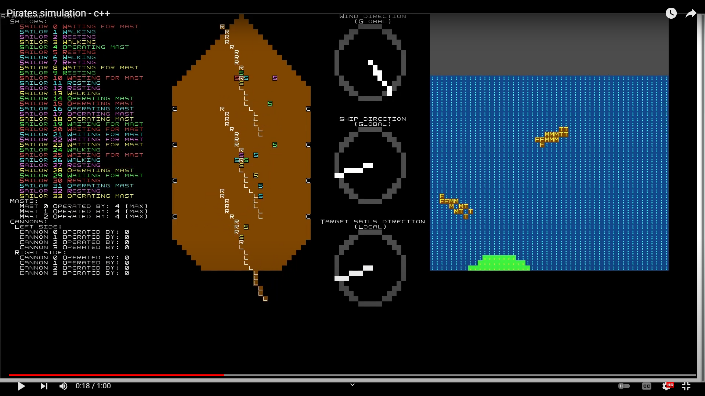

# PiratesSimulation
## Introduction
Program written for linux system using c++ with ncurses. It was created as a project for "Operating systems" university course. The goal of the project was to learn using linux multi-threading in c++.

## Features
### Simulation
* Simulation contains ships which can either wander around world or fight when they spot an enemy that isn't already fighting. Each ship has a crew which in case of wandering operates masts/sails and in case of fight operates cannons.
* Each mast can be operated by 4 sailors - the more sailors the faster given sail is adjusted. Sails concept is simplified so that ship gains speed proportionally to the alignment of sails direction with wind direction(meaning ships can go full speed even into the wind). Wind changes over time.
* Cannons need 2 sailors to operate - one of them loads the cannon and the other one shoots when it is loaded.
* Ships are generated randomly - they get random starting position, number of masts, cannons and sailors. If ship's health drops to 0 It's removed from map and a new ship is generated.
* Application has 2 display modes:
  * <em>World mode</em> - Entire world is displayed and user can move camera around.
  * <em>Ship mode</em> - Informations about given ship are displayed.

### Multi-threading
As it was required to use multiple threads in project multi-threading is heavily used even though it results in poor performance. Each ship on average uses about 25 threads, additionally every cannonball is also a thread as well as wind, display and main thread. For a simulation with 10 ships the application effectively uses about 250-275 threads.

### Interaction
* Pressing <em>spacebar</em> switches display mode.
* In <em>World mode</em>:
  * WASD or arrow keys can be used to move camera around world.
* In <em>Ship mode</em>:
  * A, D or left/right arrow keys can be used to change currently displayed ship.
* Pressing ESC key closes application.

## Technologies
* C++17

## Libraries
* ncurses
* pthreads
* [PerlinNoise - Ryo Suzuki](https://github.com/Reputeless/PerlinNoise/blob/master/PerlinNoise.hpp).

## Launch
To compile the project you will need to link against libraries <em>pthreads</em> and <em>ncurses</em>.
